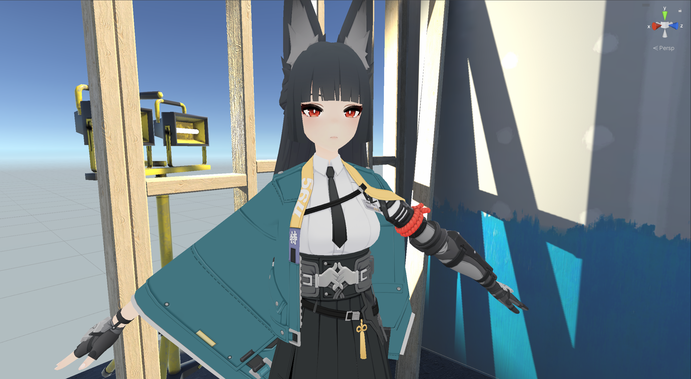
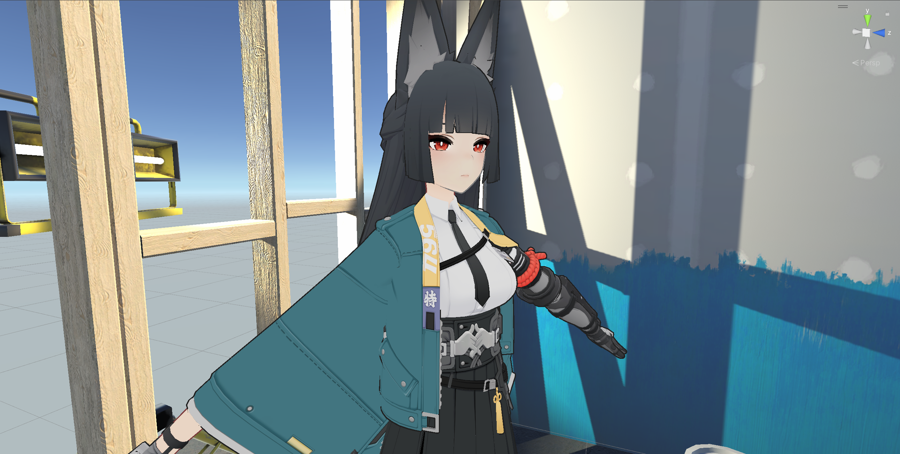
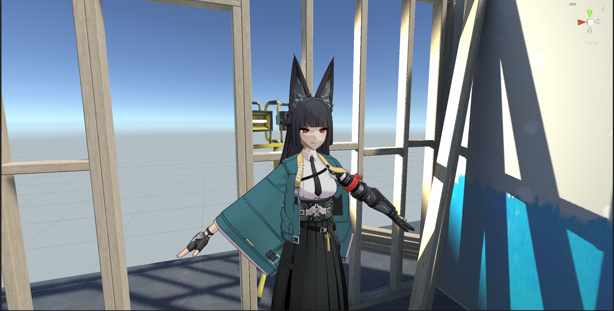
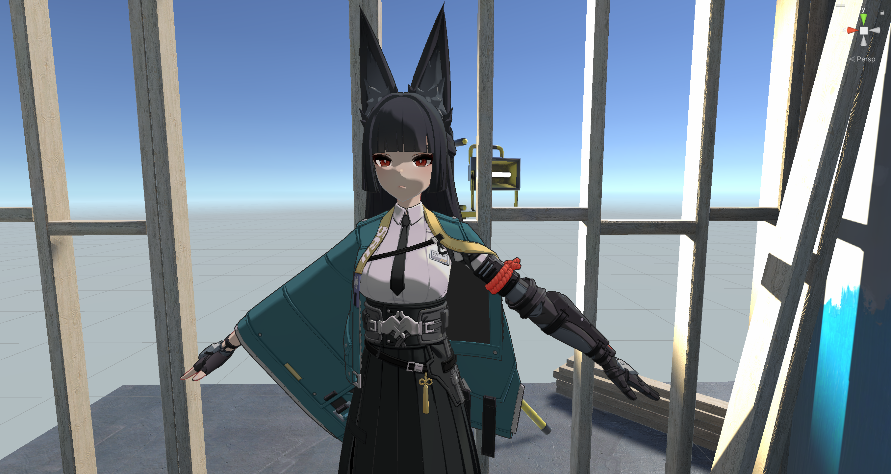
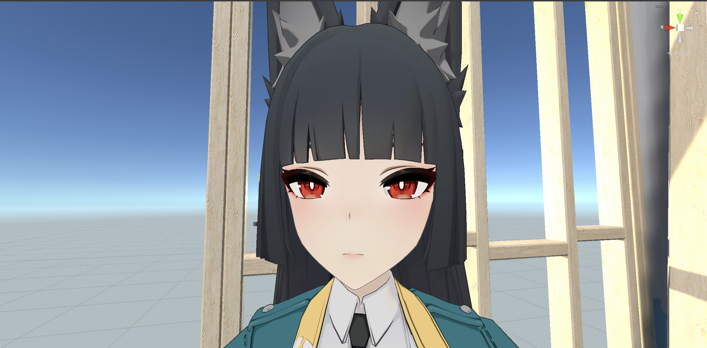
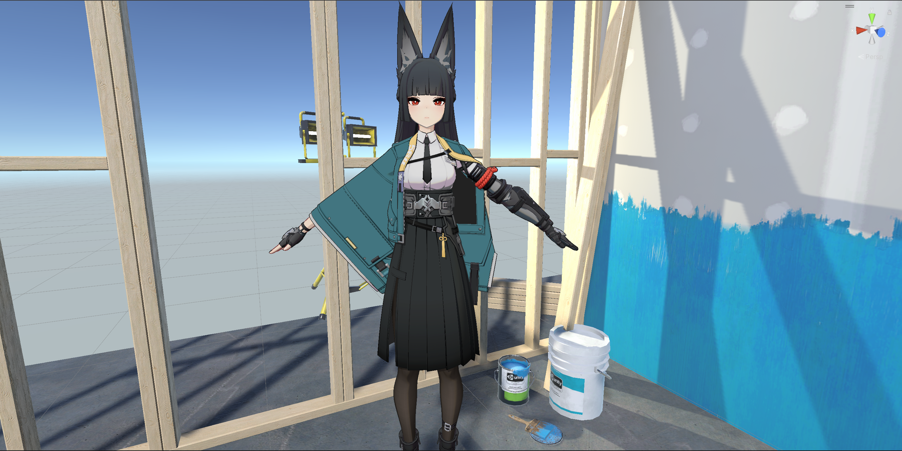
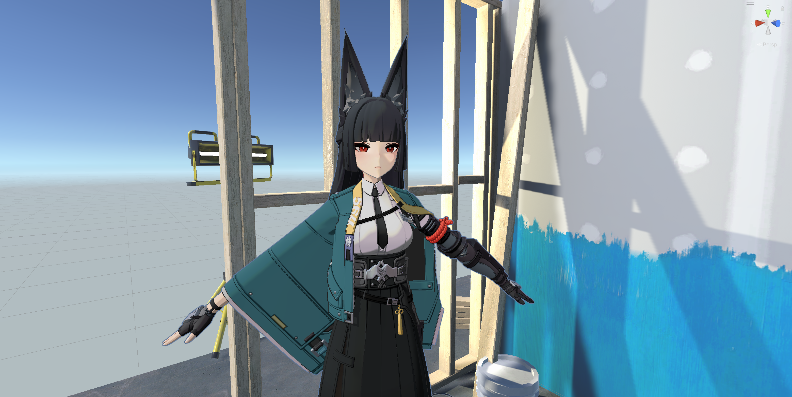
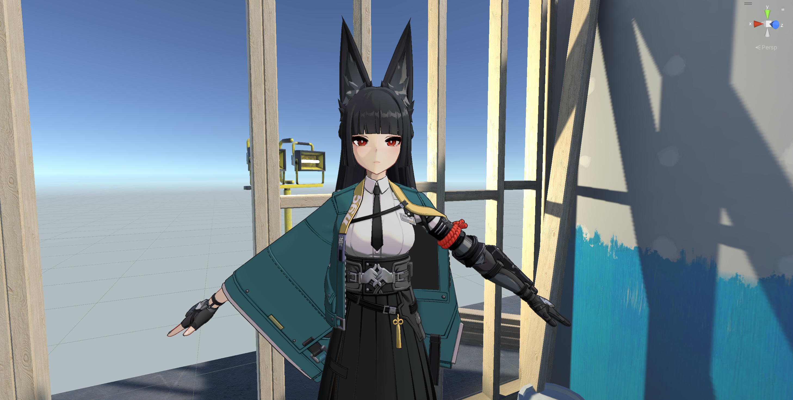

# ZZZ Render

flow this tutorials on bilibili  
[【Unity/虚幻5/Blender】3种引擎 绝区零风格 卡通渲染 星见雅 完整流程](https://www.bilibili.com/video/BV1kBBKYRE6Q)

- Editor:  Unity Version 2021.3.45f1c1 
- Project: Official Templates :URP 3D Sample 

I will show Render Changes in this README

BaseColor 

Outline(look at the Skin's outline is **Red** and Cloth is **Gray** )

Lambert Light and Shadow

Screen Space Shadow

SDF Face Shadow

Nose Line

MatCap (include gauntlet(metal armor on the arm) and pantyhose)

Gamma

Specular
